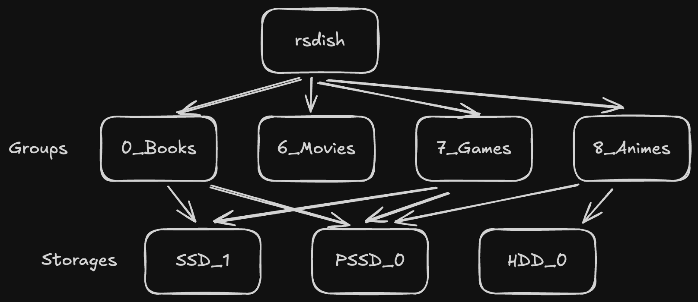

# rsdish

[简体中文](README.md) |
[English](README_en.md)

[](#)

[](https://www.rust-lang.org/)
[](LICENSE)

针对家用存储的多功能同步工具。

## 亮点
- ✅ 备份私人数据，一次设置，永久同步；
- 🛡️ 针对可能离线的家用硬盘设计；
- 🔗 通过符号链接整合散落在各种介质上的数据；
- 🖥️ Linux, Windows, MacOS支持；

## 安装

将`rsdish`添加到`PATH`；

## 原理
[](#)

## 配置方法

```toml
# rsdish.config.toml

# macOS: ~/Library/Application Support/<app>/<config_name>.toml
# Linux: ~/.config/<app>/<config_name>.toml
# Windows: %APPDATA%\<app>\<config_name>.toml

# Tip: Run `rsdish config` to print current config path

custom_storages = ["<STG_ABS_PATH>(s)"]
```

```toml
# rsdish.cabinet.toml

# For example:
# Storage_SSD/
# ├── Cabinet_Book/
# │   ├── book1.epub
# │   ├── book2.pdf
# │   ├── .srcignore
# │   └── rsdish.cabinet.toml
# └── Cabinet_Movie/
#     ├── movie1.mp4
#     └── rsdish.cabinet.toml

# Tip: Run `rsdish cabinet init` to generate an empty config file;
# Run `rsdish cabinet join` to generate a random membership.

[[memberships]]
group_uuid = "0199ebad-44ad-78a2-baad-c56a052e33ac"
priority = 0   # Higher number = higher priority (higher can override lower)

[memberships.src_option]
enable = false

[memberships.dst_option]
enable = false
cover_level = 0  # Enum: 0=DontCover, 1=HigherCover
save_level  = 0  # Enum: 0=DontSave, 1=SaveHigher, 2=SaveHigherEqual, 3=SaveAll

[memberships.link_option]
enable = false
save_level = 0
```

```ignore
# .srcignore
# The syntax of .srcignore is largely the same as that of .gitignore.
```

## 注意事项

⚠️ Windows平台下，`rsdish link`需要管理员权限，或者在Win10中开启开发者模式才能正常运行。


## License

This project is licensed under the [GNU General Public License v3.0 (GPLv3)](LICENSE).
